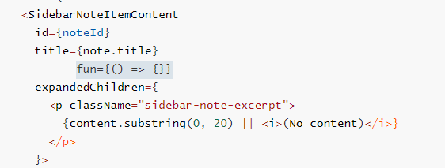
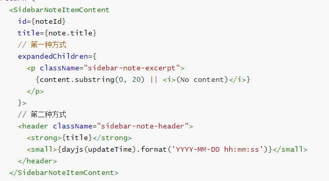
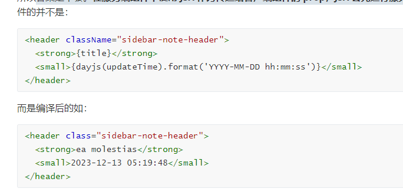

### 服务端组件可以导入客户端组件，但客户端组件并不能导入服务端组件（即在服务端组件中引入客户端组件）

### 从服务端组件到客户端组件传递的数据需要可序列化（传入函数不可以），但可以将服务端组件以 props 的形式传给客户端组件

### 在这段代码中，`SidebarNoteItem` 是一个服务端组件，在这个组件中我们引入了 dayjs 这个库，然而我们却是在 `SidebarNoteItemContent` 这个客户端组件中使用的 dayjs。请问最终客户端的 bundle 中是否会打包 dayjs 这个库？

### 答案是不会。**在服务端组件中使用 JSX 作为传递给客户端组件的 prop，JSX 会先进行服务端组件渲染，再发送到客户端组件中**。

### 尽可能将客户端组件在组件树中下移,避免依赖库被打包到客户端 bundle 中

### 使用 Suspense，数据加载不会阻塞页面，在笔记列表还在加载的时候，用户依然可以与页面其他部分进行交互，比如点击 New 按钮新建笔记。（即不用 suspense 就会卡顿，像无响应，用 suspense 可以出现其他加载的）

要对 content 类型做判断，否则报错
